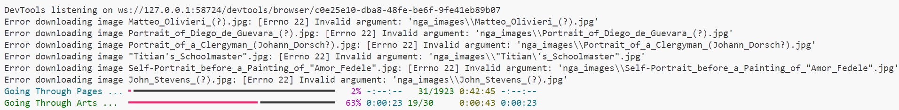

# Get Started
1. Go to https://www.notion.so/aicurator/Available-Datasets-18010685b6c84df6a7a604e36b1c69c0, and identify available sources of CC0 images for download.

2. Pull this Utilities folder, and put it somewhere you have large storage for upcoming images.

3. Download the requirements using:
    ```
    pip install -r requirements.txt
    ```

4. Download the chromewebdriver based on your operating system and chip here:
https://googlechromelabs.github.io/chrome-for-testing/ 

    Unzip the file downloaded in the same folder where the python web scraper locates

# Modify the code
## Prepartion
    
1. Open the website you want to scrape in chrome

2. Inspect the website and its elements 

3. Find corresponding tags of image and metadata you wish to fetch.


## Modification
You may need to modify a lot of parts in my starter code, but they will be easy once you located all the fields.

1. Modify the function `def scrape_artwork_data(page_source, progress, artwork_task)` to read all the fields you need.

2. Modify the way you access the search results url, and how you reach subsequent pages in `driver.get(f"url")`

3. Tune `time.sleep()` so that you wait for everything to load and leave some redundancies, but don't wait too long. 

4. Miscellaneous: Modify the progress bar `total pages`, `images per page`, `folder name`, etc


# Start Download
Before you start the entire job, you should:

1. Running one page 

2. Proceed to next page

3. Verify the downloaded contents and csv file correctness

**Important:** Run this code in vscode console, don't attempt to run any part in Jupyter notebook, it will cause failure.

After you succeeded, you should be seeing a console output like this, demonstrating your progress through the pages and progress on an individual page:




**Good Luck!**