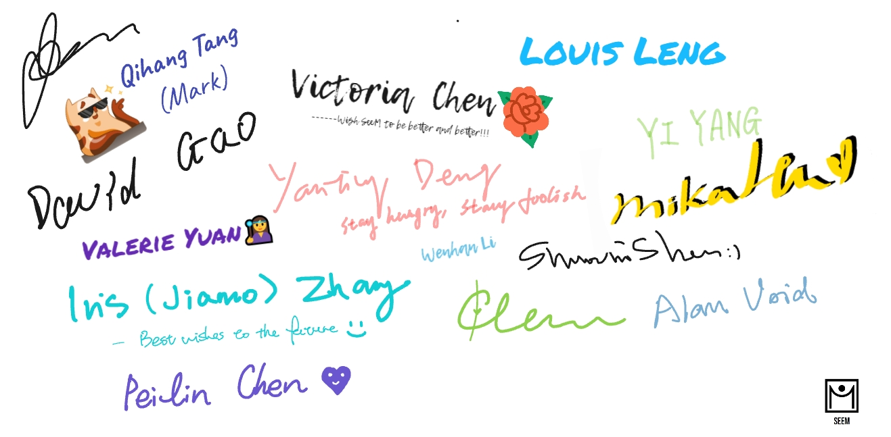

# AI-Curators

Welcome to AI-Curators, where artificial intelligence revolutionizes art education and engagement. Our web application merges AI technology with artistic exploration, enhancing accessibility and interactivity for users everywhere.

## Mission

We aim to democratize art education using AI, focusing on underprivileged students and those without traditional access to art resources. Our tools offer immersive, personalized learning experiences, making creative engagement more accessible.

## Vision

Our vision is to transform art education into a dynamic and personalized journey, overcoming geographical and socioeconomic barriers. We strive to make art universally accessible and engaging through innovative AI solutions.

## Values

We champion innovation, inclusivity, and the transformative impact of AI in arts education. Our platform supports an interactive learning environment that enriches users' experiences and fosters a community of art enthusiasts and creators.

## Codebase Overview

Here’s how our project is organized:

- **01_data_collection**: Contains scripts and utilities for web scraping and data gathering.
- **02_data_cleaning**: Includes tools and documentation for preparing data for analysis.
- **03_image_processing**: Scripts for image analysis and processing are found here.
- **04_gpt_analysis**: Houses our GPT models and analysis scripts.
- **99_legacy_code**: Legacy code for previous versions of our tools and applications.
- **README.md**: Overview and general information about the project.

To begin navigating our codebase, refer to the directory-specific README files for detailed information on the scripts and their purposes.

## Thank you for all the support!

*From our beloved team members and collaborators.*